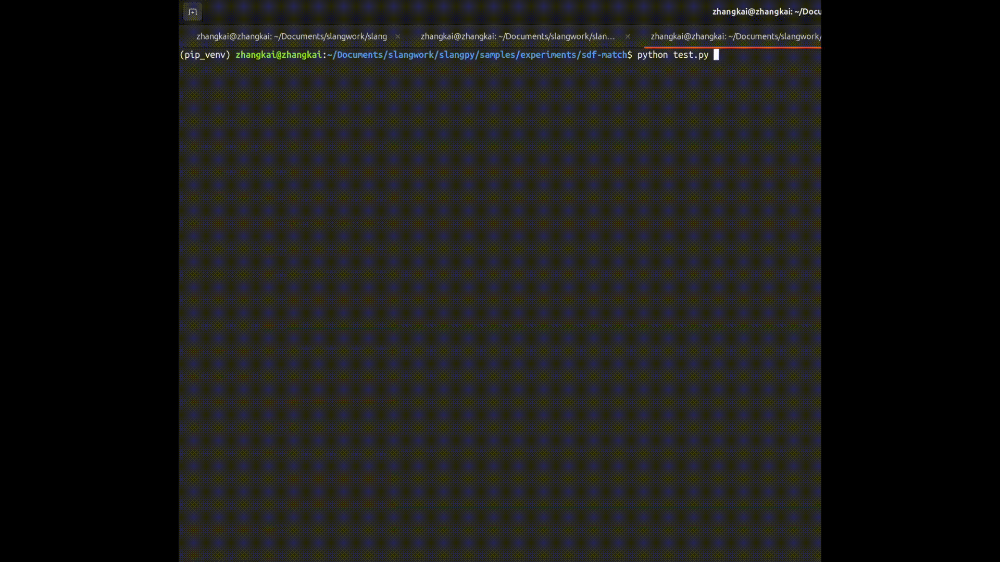

# SDF Match Example: Neural Network Training with Real-time Ray Marching

This example demonstrates a fascinating intersection of neural networks and computer graphics: training a tiny multi-layer perceptron (TinyMLP) to approximate a signed distance function (SDF) while simultaneously rendering the results using ray marching in real-time. **This example showcases SlangPy's automatic differentiation capabilities**, demonstrating how Slang can automatically generate backward propagation code or allow users to provide customized backward propagation implementations.

## Overview



The project implements a complete pipeline that:
1. **Trains a neural network** to learn a target SDF (a sphere with radius 2.0)
2. **Renders the learned SDF** using ray marching in real-time
3. **Combines training and rendering** in a single interactive application

## Architecture

### 1. TinyMLP Implementation (`tinymlp.slang`)

The neural network is implemented as a lightweight, differentiable MLP with the following architecture:

#### Network Structure
- **Input Layer**: 3 dimensions (x, y, z coordinates)
- **Hidden Layer**: 16 neurons with Leaky ReLU activation
- **Output Layer**: 1 dimension (SDF value)

### 2. Training System (`main.slang`)

The training system trains the TinyMLP to approximate a target SDF (a sphere with radius 2.0). While the target SDF function is `sqrt(x² + y² + z²) - 2.0`, the network is trained on the simplified function `x² + y² + z²` for more stable training performance.

**Why train on x² + y² + z² instead of sqrt(x² + y² + z²) - 2.0?**

The square root operation in the target SDF can cause training instability due to:
- **Gradient explosion** near the origin where the derivative of sqrt approaches infinity
- **Numerical instability** when the input values are very close to zero
- **Slower convergence** due to the non-linear transformation

By training on the squared distance `x² + y² + z²`, we avoid these issues while still learning the essential geometric structure. The network output is then transformed during rendering to recover the proper SDF values: `sqrt(network_output) - 2.0`.

The training process uses the Adam optimizer with gradient clipping to ensure stable convergence. The loss function compares the neural network's prediction with the squared distance target, enabling the network to gradually learn the implicit surface representation through gradient-based optimization.

### 3. Ray Marching Implementation (`rayMarching.slang`)

The rendering system uses ray marching to visualize the learned SDF:

#### Core Components

**SDF Interface**:
```slang
public interface ISDFModel;
```

**Ray Marcher**:
```slang
public struct RayMarcher;
```

#### Rendering Process
1. **Ray Generation**: Convert screen coordinates to world-space rays
2. **Ray Marching**: Step along each ray until hitting the surface or exceeding max distance
3. **Surface Shading**: Compute lighting using diffuse reflection
4. **Color Assignment**: Apply object colors and lighting

## Complete Workflow

### 1. Initialization (`main.py`)

```python
# Network configuration
input_size = 3
hidden_size = 16
output_size = 1
network_shape = [input_size, hidden_size, output_size]

# Generate random training data
input, input_data = generate_input(samplesSize)
params, params_grad, params_data, params_grad_data = generate_init_params(network_shape)

# Initialize Adam optimizer state
adam_state = spy.NDBuffer(app.device, dtype=module.AdamState, shape=(param_size,))
```

### 2. Training Loop

The main loop alternates between training and rendering:

```python
while app.process_events():
    # Train for 100 iterations
    iter = 0
    while iter < 100:
        result = trainMLP(iter)
        iter += 1

    # Render every 1000 iterations
    if total_iter % 1000 == 0:
        result_np = result.to_numpy()
        loss = np.sum(result_np ** 2)
        print(f"Iteration {total_iter}: Loss = {loss}")

    # Render the current state
    module.RunRayMarch(windowSize, call_id(), tiny_mlp_params.storage.device_address, _result=app.output)
    app.present()
```

### 3. Training Process

1. **Forward Pass**: Evaluate the neural network on random 3D points
2. **Loss Computation**: Compare network output with target SDF values
3. **Backward Pass**: Compute gradients using automatic differentiation
4. **Parameter Update**: Apply Adam optimizer to update network weights
5. **Gradient Reset**: Clear gradients for next iteration

### 4. Rendering Process

1. **Ray Generation**: Convert screen pixels to world-space rays
2. **SDF Evaluation**: Use the trained network to evaluate SDF values
3. **Ray Marching**: Step along rays until hitting surfaces
4. **Shading**: Apply lighting and materials
5. **Display**: Present the rendered image

## Key Code References

For implementation details, refer to these key structures in the source code:

### Neural Network Components
- **`Layer<input_size, output_size>`** (`tinymlp.slang:8-75`): Core neural network layer with forward/backward passes
- **`Layer::backward()`** (`tinymlp.slang:37-75`): Custom backward propagation implementation with gradient accumulation
- **`TinyMLP`** (`tinymlp.slang:77-135`): Complete MLP network combining two layers
- **`TinyMLP_Params`** (`main.slang:15-18`): Parameter storage structure for GPU buffers

### Training Components
- **`AdamState`** (`main.slang:8-14`): Adam optimizer state variables
- **`AdamOptimizer`** (`main.slang:20-40`): Adam optimization implementation
- **`loss()`** (`main.slang:75-85`): Loss function for SDF approximation with automatic differentiation
- **`trainMLP()`** (`main.slang:87-95`): Main training function demonstrating SlangPy's auto-diff capabilities

### Rendering Components
- **`Ray`** (`rayMarching.slang:12-16`): Ray structure for ray marching
- **`ISDFModel`** (`rayMarching.slang:18-23`): Interface for SDF models
- **`LearnedSDFModle`** (`rayMarching.slang:25-45`): Neural network-based SDF implementation
- **`RayMarcher`** (`rayMarching.slang:70-126`): Ray marching algorithm implementation
- **`RunRayMarch()`** (`main.slang:97-143`): Main rendering function

### Application Framework
- **`App`** (`app.py:6-134`): Window management and rendering pipeline setup
- **Main loop** (`main.py:75-105`): Training and rendering integration

## Usage

### Running the Example
```bash
cd samples/experiments/sdf-match
python main.py
```

### Expected Behavior
1. The application opens a window showing a rendered scene
2. Initially, the rendered object will appear distorted or incorrect
3. As training progresses, the object will gradually converge to a sphere
4. The loss value printed every 1000 iterations should decrease over time
5. The final result should show a smooth, well-lit sphere

### Convergence
- Training typically converges within 10,000-50,000 iterations
- Loss should decrease from ~4.0 to <0.1
- Visual convergence usually occurs before numerical convergence

## Applications

This example demonstrates several important concepts:

1. **Automatic Differentiation**: SlangPy's powerful auto-diff capabilities for gradient-based learning
2. **Neural SDFs**: Learning implicit surface representations using differentiable networks
3. **Differentiable Rendering**: End-to-end optimization of graphics pipelines
4. **Real-time Training**: Interactive machine learning applications with GPU acceleration
5. **Custom Backward Propagation**: How to implement specialized gradient computations when needed